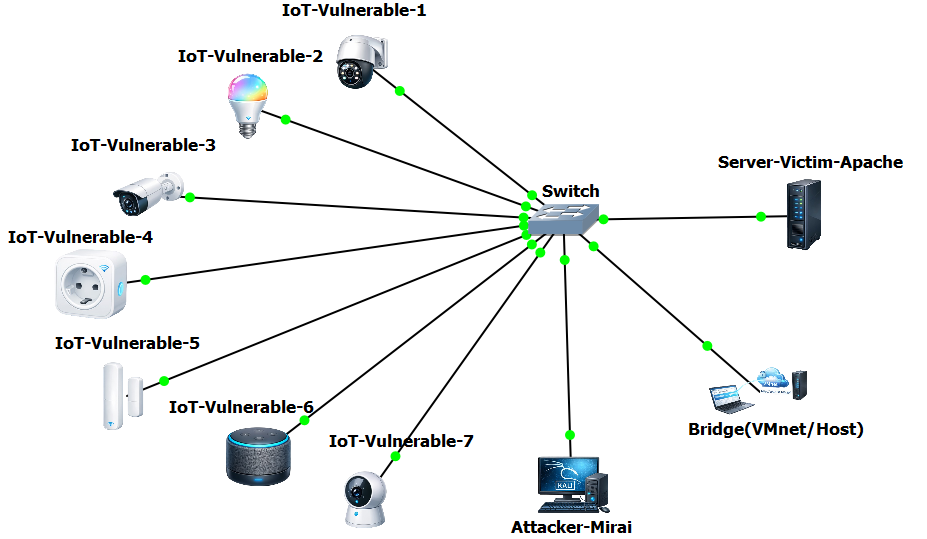
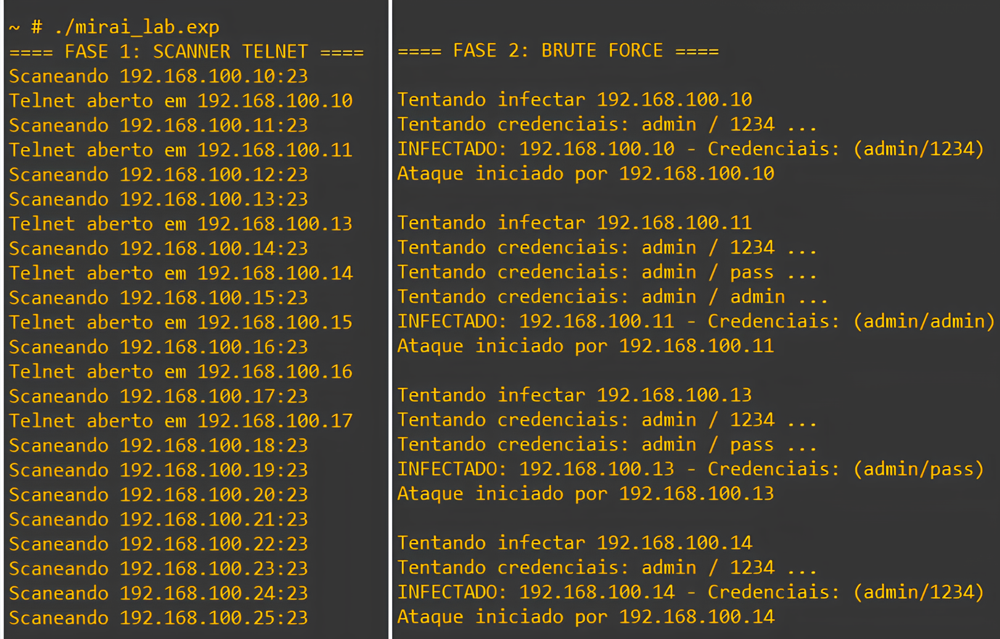
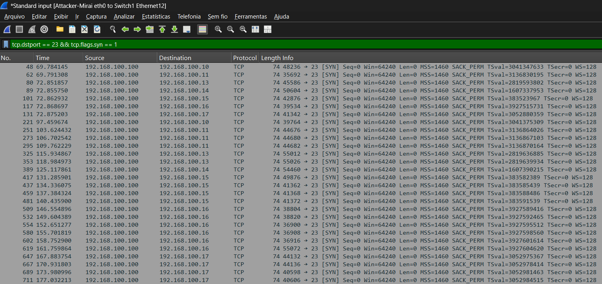
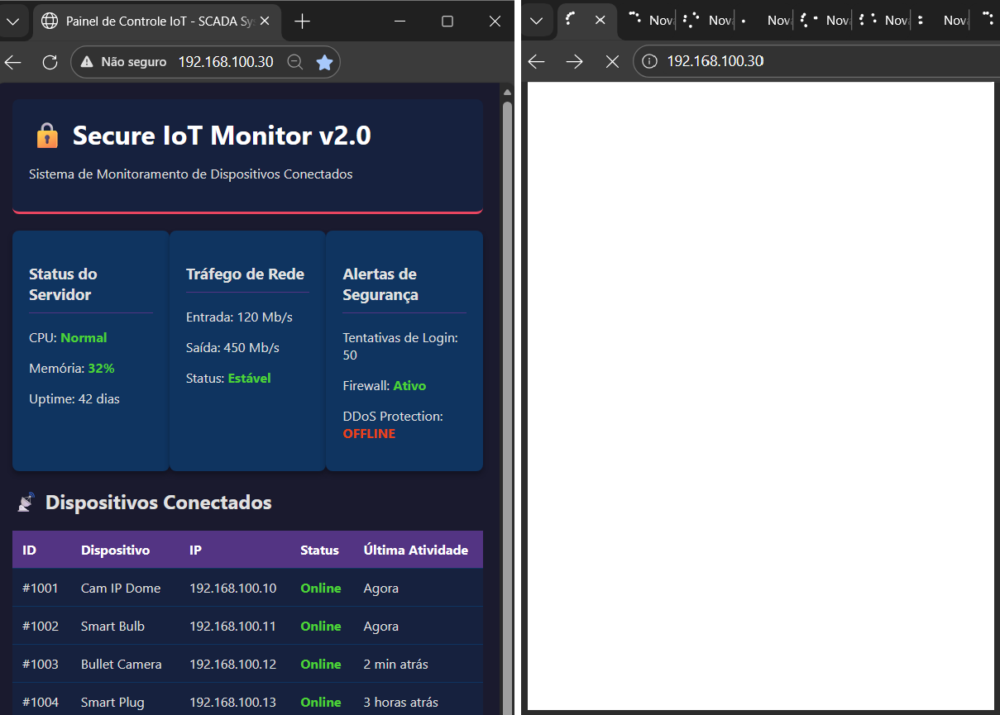
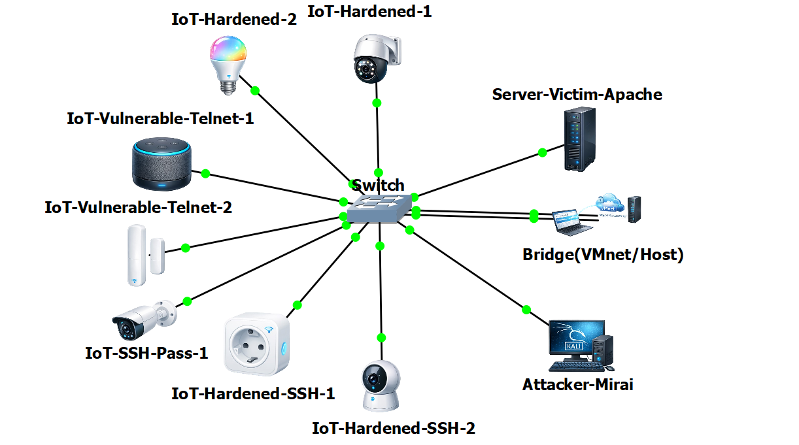

# Laboratório Experimental de DDoS em Redes IoT com Simulação Inspirada na Botnet Mirai

Este projeto foi desenvolvido como parte do meu Trabalho de Conclusão de Curso (TCC) e apresenta um laboratório de redes IoT em um ambiente de simulação controlado, criado para reproduzir, de forma didática, segura e reprodutível, um cenário de ataque DDoS inspirado na botnet **Mirai**. O laboratório também permite analisar a eficácia de medidas defensivas baseadas em hardening e redução da superfície de ataque em diferentes perfis de dispositivos IoT.

## Objetivo

- Simular, em laboratório, um cenário inspirado no comportamento da botnet Mirai em redes IoT.
- Observar o impacto de dispositivos com diferentes posturas de segurança.
- Avaliar medidas defensivas como remoção de serviços desnecessários, fechamento de portas, substituição de Telnet por SSH, uso de senhas fortes e autenticação por chaves assimétricas.

## Metodologia

A pesquisa segue uma abordagem experimental e comparativa, realizada em laboratório controlado, com foco na reprodução de cenários ofensivos e defensivos em redes IoT. A simulação foi conduzida no **Graphical Network Simulator-3 (GNS3)**, com suporte da **GNS3 VM** executada em hipervisor. Dentro dessa máquina virtual, o **Docker** foi utilizado, por meio da interface do GNS3, para instanciar os nós da topologia como contêineres baseados em Alpine Linux, com imagens definidas em seus respectivos [`Dockerfile`](docker). Para captura e inspeção do tráfego de rede, bem como para geração de evidências experimentais, utilizou-se o **Wireshark**. O monitoramento do servidor vítima foi realizado com ferramentas nativas do sistema.

## Topologia do Cenário de Ataque

<em>Figura 1 — Topologia do ataque.</em>

  

## Imagens Docker e Papéis dos Nós

Foram construídas imagens Docker com funções bem definidas, de modo que cada imagem possuía suas dependências explicitamente declaradas no `Dockerfile` e instaladas automaticamente durante a preparação e inicialização do ambiente. Essa padronização garantiu que cada contêiner reproduzisse, de forma consistente, o comportamento descrito para cada tipo de dispositivo na simulação.

### 1. Atacante (`Attacker-Mirai`)

Contêiner com Telnet/SSH e automação em Expect, empregando o script [`mirai_lab.exp`](docker/iot-ddos-lab/mirai_lab.exp) para automatizar varredura, tentativas de autenticação por bruteforce com uma wordlist simples em [`wordlist.txt`](docker/iot-ddos-lab/wordlist.txt), confirmação de acesso e acionamento da carga de ataque a partir dos nós comprometidos. Ao assumir o controle do bot, o script injeta o comando de acionamento do **ApacheBench (ab)**, instruindo o nó IoT comprometido a iniciar um HTTP flood massivo contra o IP do servidor vítima, operando em background.

### 2. Servidor vítima (`Server-Victim-Apache`)

Contêiner executando Apache HTTP Server na porta 80, responsável por prover uma página web estática em HTML por meio do arquivo [`index.html`](docker/server-victim/index.html), permitindo observar degradação de responsividade e indicadores de estresse durante o cenário de ataque.

### 3. Dispositivos IoT (famílias de nós)

Contêineres configurados para representar diferentes posturas de segurança, variando conforme o serviço remoto exposto (Telnet ou SSH), o tipo de autenticação (senhas fracas, senhas fortes ou chaves) e a presença ou ausência de serviços desnecessários. O perfil vulnerável base, com a porta  Telnet (23/TCP) exposta foi definido em [`/iot-vulnerable/Dockerfile`](docker/iot-vulnerable/Dockerfile).

## Evidências do Cenário Ofensivo

<em>Figura 2 — Execução do script inspirado na Mirai: varredura Telnet e tentativas de credenciais.</em>

  

<em>Figura 3 — Captura de pacotes pelo Wireshark evidenciando a varredura na porta 23/TCP pelo atacante.</em>

  

<em>Figura 4 — Serviço web estático do servidor vítima: carregamento normal vs. indisponibilidade após DDoS.</em>

  

## Estratégia de Mitigação

Após a execução do cenário ofensivo, foram aplicadas contramedidas orientadas ao hardening e à redução da superfície de ataque. Para isso, os nós IoT do laboratório foram substituídos por perfis com diferentes posturas de segurança, e o ciclo de ataque foi repetido de forma controlada.

## Topologia do Cenário de Mitigação

<em>Figura 5 — Topologia da mitigação.</em>

  

### Perfis de Mitigação

#### `IoT-Hardened` — sem portas expostas

Neste perfil, definido em [`/iot-hardened/Dockerfile`](docker/iot-hardened/Dockerfile), foram removidos serviços de acesso remoto, como o `telnetd`, e fechadas as portas correspondentes, simulando um dispositivo configurado estritamente com os serviços essenciais para sua operação. O objetivo foi testar a hipótese de redução máxima da superfície de ataque, avaliando se a indisponibilidade de portas inviabiliza o encadeamento do ataque ainda na fase inicial de reconhecimento, antes mesmo da etapa de força bruta.

#### `IoT-Vulnerable-Telnet` — Telnet + senha forte

Neste perfil, mantido em [`/iot-vulnerable/Dockerfile`](docker/iot-vulnerable/Dockerfile), o serviço Telnet permaneceu ativo e exposto na porta 23/TCP, porém as credenciais padrão foram substituídas por uma senha complexa. O propósito foi isolar a variável de autenticação, testando o comportamento do dispositivo frente à execução do script de brute force.

#### `IoT-SSH-Pass` — SSH + senha

Neste cenário, descrito em [`/iot-hardened-ssh-pass/Dockerfile`](docker/iot-hardened-ssh-pass/Dockerfile), o acesso remoto foi migrado para SSH, mantendo autenticação baseada em senha. O objetivo foi configurar um ambiente com canal cifrado para testar a proteção da confidencialidade do tráfego em rede, ao mesmo tempo em que se avalia a persistência da vulnerabilidade do dispositivo contra ataques de força bruta devido ao uso de senhas.

#### `IoT-Hardened-SSH` — SSH + chaves; senha desabilitada

Neste perfil, implementado em [`/iot-hardened-ssh/Dockerfile`](docker/iot-hardened-ssh/Dockerfile), a migração para SSH ocorreu com autenticação exclusiva por chaves assimétricas e desativação total do login por senha. O objetivo é eliminar o vetor de adivinhação por brute force e restringir o acesso remoto estritamente aos administradores do dispositivo.

Para essa defesa, adota-se um par de chaves criptográficas RSA 2048 bits:

- **Chave pública:** provisionada nativamente no dispositivo IoT e armazenada no arquivo `authorized_keys` do usuário legítimo, atuando como uma “fechadura” digital.
- **Chave privada:** mantida exclusivamente no lado do cliente legítimo. Sem a posse deste artefato, a autenticação falha, mesmo com o serviço SSH ativo.

A arquitetura baseada em chaves assimétricas garante segurança por meio de um mecanismo de desafio e resposta. Durante a tentativa de conexão, o cliente assina um desafio com sua chave privada, e o dispositivo IoT verifica a validade da assinatura usando a chave pública previamente cadastrada. Como a chave privada nunca trafega na rede, o modelo neutraliza riscos de interceptação e elimina o vetor tradicional de brute force por senha.

## Discussão e Interpretação dos Resultados

Os resultados confirmam que, quando o serviço está acessível e a autenticação é vulnerável a brute force com wordlist, o recrutamento de nós torna-se operacionalmente simples, e a distribuição da carga amplia o impacto sobre o servidor vítima.

Do ponto de vista defensivo, observou-se que a redução da superfície de ataque constitui uma medida estrutural, pois atua antes do comprometimento, impedindo a formação de bots. Quando há necessidade de administração remota, os cenários com SSH demonstram que a criptografia de canal protege a confidencialidade do tráfego, mas não elimina, por si só, o risco de comprometimento caso a autenticação por senha permaneça fraca.

Assim, a postura mais robusta é obtida com autenticação por chaves e desativação do login por senha, reduzindo significativamente a viabilidade de ataques por brute force e eliminando a exposição de credenciais em trânsito.

## 🛠️ Tecnologias Utilizadas

